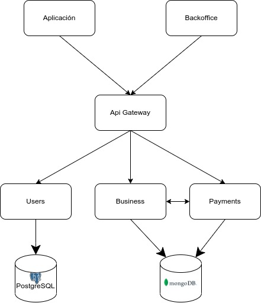

# Introducción
&nbsp;&nbsp;&nbsp;&nbsp;Para el desarrollo del producto se utilizó la arquitectura de microservicios. A continuación se detallará de qué forma se distribuyeron las distintas tareas a los distintos servicios, y cuál es la función principal de cada uno. En particular decidimos utilizar el patrón de Api Gateway, que facilita la implementación del front end de la app, haciendo que este solo le tenga que manejar una única dirección para obtener los servicios (de otra manera tendrían que manejar a qué dirección mandar una request para cada acción que quieran realizar).

# Gráfico de interacciones
Un diagrama que facilita el entendimiento de cómo se relaciona el frontend con el backend, y cómo se relacionan los distintos backends entre sí es el siguiente:  

# Api gateway
&nbsp;&nbsp;&nbsp;&nbsp;Este servicio es la puerta de acceso principal a todas las funcionalidades del programa. Puede ser accedido por cualquier dispositivo y permite acceso a todas las funcionalidades de la aplicación. Al permitir la abstracción del frontend de la existencia de más de un microservicio, es el mismo Api Gateway quien se encarga de delegarle las distintas requests necesarias a los distintos servicios implementados. Puede verse entonces que es el orquestrador que se encarga de que todas las acciones sean ejecutadas en el orden correcto. Un ejemplo de una acción que requiere llamados a más de un backend es el registro de un usuario, ya que en un principio se realiza un registro de la cuenta (mail y contraseña) en el backend Users, y luego (en caso de que la operación haya sido exitosa) se realiza una creación del nuevo perfil del usuario en el backend Business.  
&nbsp;&nbsp;&nbsp;&nbsp;Al ser el orquestrador y encargarse de la integridad de la aplicación manejando las requests que deben ser enviadas, es necesario que no puedan conectar con estas entidades otros hosts que no sean el api gateway. Es por esto que se implementó como medida de seguridad las api keys, que permiten asegurar dentro de cada servicio que quien lo contacta es una entidad autorizada, y de esa forma no se amenace la integridad de la aplicación.

# Users
&nbsp;&nbsp;&nbsp;&nbsp;Este servicio es quien se encarga de las operaciones de registro y login de usuarios, tanto utilizando el método implementado por nosotros como utilizando un método de login federado. Guarda un registro de todos los alumnos de la aplicación, y otorga métricas de momentos de registro y loggeo de los usuarios. Este servicio conecta también con una instancia de base de datos relacional de Postgres, que se encuentra adjuntada a la aplicación en Heroku (donde se encuentran deployados todos los servicios implementados para poder ser accedidos a través de internet), a la que se mandan requests sql para poder persistir de forma apropiada los datos mencionados previamente.

# Business
&nbsp;&nbsp;&nbsp;&nbsp;Este es el servicio principal en cuanto a ejecución de las funcionalidades que no están relacionadas al registro o pagos. Maneja todo lo que tenga que ver con interacción de un usuario con elementos de la aplicación, es decir, guarda la información de los cursos que un usuario dicta, los que puede ver por estar suscripto, etc. Toda funcionalidad relacionada con la lógica de ejecución de servicios brindados a usuarios relacionados con cursos (creación de cursos y exámenes, suscripción a cursos, etc) se encuentra implementada en este backend. A diferencia de Users, que como se dijo previamente utiliza una base de datos relacional, Business utiliza una base de datos no relacional de Mongo que se encuentra hosteada por Atlas. Allí se almacenan todos los datos relacionados con los perfiles, cursos y exámenes.

# Payments
&nbsp;&nbsp;&nbsp;&nbsp;Este es el servicio que implementa todas las funcionalidades relacionadas con el pago por servicios relacionados con la aplicación. Maneja internamente wallets conectadas a una blockchain, y se encarga del pago y cobranza de dinero (en ethereum) para los usuarios. Para el caso de payments, también hay interacción entre este y Business. Al igual que Business, Payments utiliza la base de datos no relacional de Atlas, en donde persiste registros de los pagos realizados.
