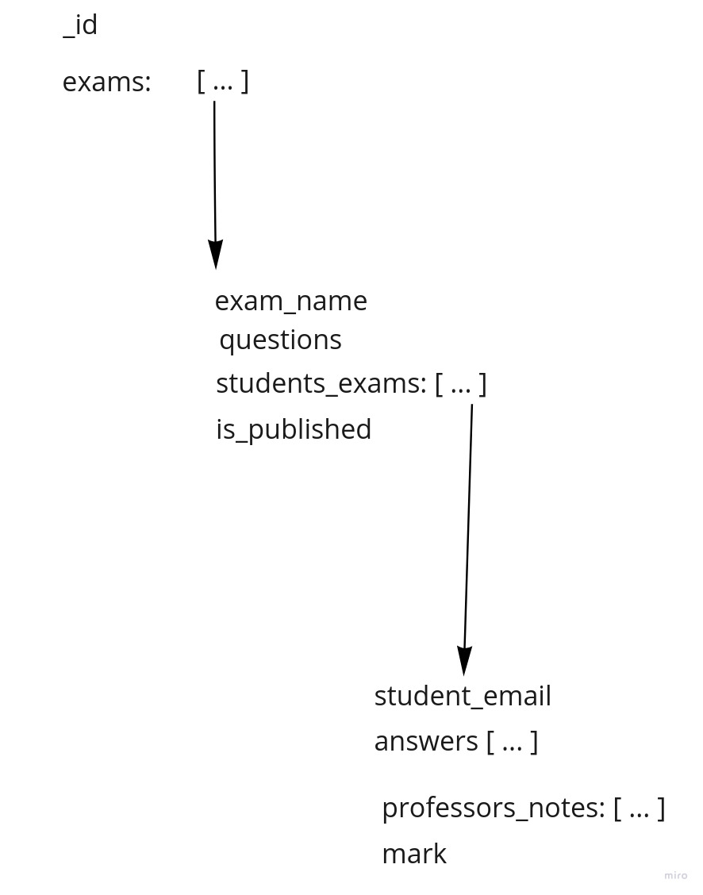

# Introducción
&nbsp;&nbsp;&nbsp;&nbsp;A lo largo del cuatrimestre se estuvo implementando un programa llamado "Ubademy", un clon de sitios de clases online. Para lograrlo se utilizó una arquitectura de microservicios, utilizando el patrón de Api Gateway. A continuación se explicarán tecnicismos de la aplicación tanto en forma macroscópica como microscópica.

Se aclara que las documentaciones de open api de los servicios se encuentran en los siguientes lugares:
- Api Gateway: https://ubademy-api-gate.herokuapp.com/docs
- Users: https://ubademy-users-backend.herokuapp.com/docs
- Business: Este repositorio, en Documentation/business_open_api.md
- Payments: Este repositorio, en Documentation/payments_open_api.md


# Api gateway
&nbsp;&nbsp;&nbsp;&nbsp;El servicio de Api Gateway fue implementado utilizando el lenguaje de programación Python, junto con una cantidad de bibliotecas excternas que facilitaron la contrsucción del backend. Su razón de ser es delegar los distintos procesos a realizar en los backends correspondientes. las bibliotecas utilizadas son:  
- Uvicorn: es la biblioteca utilizada para levantar un server que escucha requests, es utilizado por FastApi para poder procesarlas correctamente.
- FastApi: es la bilbioteca que fue usada principalmente, en conjunto con otras bibliotecas. Se encarga de procesar los requests HTTP que llegan al servidor levantado con uvicorn, facilitando enormemente la creación de endpoints y dejando así mayor tiempo de desarrollo para las funcionalidades con las que dichos endpoints están asociados. Esta biblioteca no fue utilizada únicamente para el parseo de requests recibidas, sino que también para la creación de schemas para los cuerpos de los requests HTTP, lo cual también facilita el trabajo manual de chequeos (se verá luego que en el caso de los servidores que corren node, a pesar de usar bibliotecas externas, se debió realizar un trabajo más manual para asegurar cierta composición de los cuerpos de los pedidos HTTP). 
- Requests: fue utilizado para enviar los requests necesarios a los otros servicios del backend (como se indicó en el archivo de descripción de la arquitectura, api gateway se encarga de delegar las distintas tareas del servidor a los correspondientes backends).
- jose: es la biblioteca utilizada para validar los requests que le llegan de un usuario al servidor, es decir, es la biblioteca que genera y valida JWTs, permitiendo asegurar que los pedidos HTTP pertenecen a usuarios loggeados al sistema y, de esa forma, identificarlos, previniendo la posibilidad de cambios imprevistos en cuentas de usuarios por falta de chequeo de validez de la información recibida. Al generarse un JWT con una clave secreta conocida únicamente por Api Gateway, únicamente este puede desencriptar el mensaje enviado en cada request y, por lo tanto, verificar que la información no solo sea válida, sino que además haya sido enviada por alguien que previamente validó el servidor.

# Users

## Introducción
&nbsp;&nbsp;&nbsp;&nbsp;El servicio de users fue implementado utilizando el lenguaje de programación Python, al igual que Api Gateway. Este servicio se encarga de validar la existencia de un usuario que intenta loggearse, además de permitir el registro de nuevos usuarios. Permite el login tanto de usuarios registrados con la implementación propia de registro como con el uso de una identidad federada, que en este caso se trata de; además de manejar si cada usuario puede o no entrar a su cuenta (que puede estar bloqueada). Maneja también el login y registro de administradores, que son usuarios con permisos que un usuario normal no posee.  

## Base de datos
&nbsp;&nbsp;&nbsp;&nbsp;Para el registro de usuarios, se utilizó una base de datos Postgres hosteada por Heroku, y para interactuar con ella se utiliza la biblioteca SqlAlchemy, aprovechando sus funcionalidades de Object Relational Mapping (ORM). Por esto se crearon distintos objetos que representan entradas de las distintas tablas que fueron creadas. Los distintos modelos creados son los siguientes:

### User
```
class User(Base):
    __tablename__ = "users"

    email = Column(String(database_shared_constants.CONST_EMAIL_LENGTH), primary_key = True)
    hashed_password = Column(String(database_shared_constants.CONST_HASH_LENGTH), nullable = False)
    firebase_password = Column(String(database_shared_constants.CONST_HASH_LENGTH), nullable = False)
    is_blocked = Column(Boolean(), nullable = False)
    registration_date = Column(DateTime(), nullable = False)
    last_login_date = Column(DateTime(), nullable = False

    TODO: UPDATEAR CON LA DATA DEL EXPO TOKEN

```

&nbsp;&nbsp;&nbsp;&nbsp;Puede verse que un usuario normal almacena el email (que es lo utilizado para identificarlo en la plataforma, puede verse que es la primary key de la tabla, por lo que no puede repetirse), una contraseña hasheada y con sal (para proteger la cuenta del usuario en caso de que se filtren las contraseñas), una contraseña de firebase para que el usuario pueda utilizar correctamente la funcionalidad de chat, y una columna llamada is_blocked, que indica si el usuario se encuentra o no bloqueado de su cuenta y, por lo tanto, si puede acceder a ella o no. Por otro lado, pueden verse las columnas registration_date y last_login_date, que se utilizan para poder calcular métricas de registro y loggeo de usuarios en cierta ventana de tiempo (para que sea simple testear, se decidió tener una ventana de 1 día de registro y 1 hora de login, es decir, serán tomados en cuenta para 
las métricas de registro aquellos que se hayan registrado en la cuenta hace menos de 1 día, y para login los que se hayan loggeado hace menos de 1 hora).


### Google
```
class Google(Base):
    __tablename__ = "Google"

    email = Column(String(database_shared_constants.CONST_EMAIL_LENGTH), primary_key = True)
    firebase_password = Column(String(database_shared_constants.CONST_HASH_LENGTH), nullable = False)
    is_blocked = Column(Boolean(), nullable = False)
    registration_date = Column(DateTime(), nullable = False)
    last_login_date = Column(DateTime(), nullable = False)

    TODO: UPDATEAR CON LA DATA DEL EXPO TOKEN

```

&nbsp;&nbsp;&nbsp;&nbsp;Es evidente que la tabla de usuarios que se loggean con Google es muy similar a la de los usuarios que utilizan nuestro sistema de registro propio, con la diferencia de que estos no tienen contraseña. Esto se debe claramente al hecho de que, al utilizar el loggeo con Google, el usuario está utilizando su contraseña de Google para generar el certificado que a nosotros nos indica que es un usuario válido.


### Admin
```
class Admin(Base):
    __tablename__ = "admins"

    email = Column(String(database_shared_constants.CONST_EMAIL_LENGTH), primary_key = True)
    hashed_password = Column(String(database_shared_constants.CONST_HASH_LENGTH), nullable = False)
    name = Column(String(database_shared_constants.CONST_NAME_LENGTH), nullable = False)
```

&nbsp;&nbsp;&nbsp;&nbsp;Fue implementado también el usuario de tipo admin, que es un tipo de usuario distinto con permisos que un usuario normal no posee. Puede verse que solo tiene un mail, un nombre y una contraseña (hasheada al igual que en el caso de un usuario normal). Es un usuario de distinta categoría, a pesar de que los mails de los admins no pueden repetirse entre sí, no hay problema si un mail es utilziado para una cuenta normal y de admin. Un admin no tiene las funcionalidades del usuario normal (suscripción, creación de curso, etc.).

## Bibliotecas

Como se dijo previamente, las bibliotecas utilizadas por este servicio son:
- Uvicorn: por las mismas razones que en Api Gateway, levanta el servidor que escuchará los requests que vienen de Api Gateway.
- Fastapi: por las mismas razones que en Api Gateway, permite abstraerse del parseo de mensajes recibidos, redirigiendo los distintos requests HTTP a la función que la maneja de la forma apropiada.
- Psychopg2: para manejar las distintas causas de errores al momento de actualizar las tablas de usuarios y así responder con un mensaje de error apropiado.
- SqlAlchemy: como se dijo previamente, para manejar el mapeo de objetos de Python a entradas de tablas, utilizando sus funcionalidades de Object Relational Mapping (ORM).
- Passlib: utilizada para el hasheo de la contraseña de usuario y para la generación de una contraseña aleatoria para firebase.

## Funcionalidades

### Registro y log in

&nbsp;&nbsp;&nbsp;&nbsp;Como se dijo previamente, este backend se encarga del registro y login de usuarios, para esto se utiliza una serie de endpoints, unos para el registro y login de un usuario normal, y otro para el registro o login de un usuario que utiliza Google para entrar a la aplicación.  
&nbsp;&nbsp;&nbsp;&nbsp;Si el usuario quiere tener una cuenta con contraseña manejada por Ubademy, entonces primero deberá registrarse, proporcionando el usuario y contraseña que querrá usar para loguearse las siguientes veces. Si por otro lado quiere registrarse y loguearse utilizando una cuenta de Google, entonces deberá hacer log in en la cuenta de Google para obtener un token, que será validado por Api Gateway, si este es aprobado entonces se le indicará a Users que se quiere loguear un usuario con identidad federada. Si el usuario ya existía entonces simplemente se retorna que este ya existía, sino se guarda en la tabla de usuarios con login federado y se retorna en el mensaje de respuesta que el usuario fue registrado.  
&nbsp;&nbsp;&nbsp;&nbsp;Es necesario aclarar que un usuario no puede loggearse de las dos formas, sino que debe escoger una. En caso de que tenga una cuenta normal se le negará el acceso con login federado, y en caso de que su cuenta se haya creado por utilizar un login federado no se le permitirá crear una cuenta normal. Esto se realiza haciendo una query en cada tabla según lo necesite el contexto sabiendo así en qué tabla realmente está guardado el usuario.

### Obtención de métricas
&nbsp;&nbsp;&nbsp;&nbsp;Esta funcionalidad retorna la cantidad total de usuarios de la plataforma, la cantidad de usuarios que se registraron el último día, la cantidad de usuarios bloqueados, y la cantidad de usaurios que se loguearon en la última hora, siempre diviendo seǵun el tipo de login del usuario (excepto en la cantidad de usuarios de la plataforma y la cantidad de usuarios bloqueados). Esta funcionalidad solo debe ser accedida por un administrador, sin embargo, el chequeo necesario es realizado por Api Gateway, quien rebota al usuario si no cumple con los requisitos necesarios.

TODO: AGREGAR INFORMACIÓN SOBRE EL ENVIADO DE MENSAJES
TODO: AGREGAR INFORMACIÓN DEL LISTADO DE USUARIOS Y SOBRE BLOQUEAR USUARIOS

# Business

## Introducción
&nbsp;&nbsp;&nbsp;&nbsp;El servicio de users fue implementado en Javascript, utilizando Node js. Este servicio se encarga de realizar las operaciones necesarias para que el usuario pueda interactuar con la aplicación de la forma apropiada, es decir, todas las funcionalidades que permiten que un usuario interactúe con cursos y otros usuarios. A continuación se explicará más en detalle las distintas secciones del backend.

## Base de datos
A diferencia del servicio Users, Business interactúa con una base de datos no relacional de Mongo, hosteada en Atlas. Allí almacena todos los datos necesarios para la funcionalidad general de la app, los cursos creados, los perfiles, los examenes y los pagos realizados.

### Profile

```
class UserProfile
    name: string;
    profile_picture_link: string;
    email: string;
    country: string;
    subscription_type: string;
    interesting_genres: string[];
    collaborator_courses: string[];
    subscribed_courses: string[];
    passed_courses: string[];
```

Puede verse que el perfil guarda el nombre del usuario, un link que lleva a su foto de perfil (hosteada en firebase), su email de registro (que es único para cada perfil, no puede repetirse), el país al que pertenece el usuario, los géneros de cursos que le interesan, el tipo de suscripción, los ids de los cursos en los que colabora, los id de los cursos a los que está suscripto, y los ids de los cursos que aprobó. Toda esta información es utilizada para las operaciones normales de los usuarios, como se verá en las siguientes secciones del documento.

### Course

```
class Course 
    creator_email: string;
    title: string;
    description: string;
    total_exams: Number;
    hashtags: string[];
    images: string[];
    videos: Array<Video>;
    country: string;
    course_type: string;
    subscription_type: string;
    collaborators: string[];
    students: string[];
    students_grading: CourseGrading[];


interface Video 
    name: string;
    url: string;

class CourseGrading 
    student_email: string;
    comment: string;
    grade: Number;

```

Puede verse que el documento de cursos guarda una mayor cantidad de elementos en cada entrada que el perfil, esto se debe a que es utilizada para muchas mas funcionalidades. Estas se analizarán luego, explicando qué entradas de los documentos utilizan para funcionar correctamente.


### Exam

```
class Exam
    exam_name: string;
    questions: string[];
    students_exams: CompletedExam[];
    is_published: boolean;


class CompletedExam
    student_email: string;
    answers: string[];
    professors_notes: string[];
    mark: Number;
```

Al igual que en el caso de los cursos, al utilizarse para una gran cantidad de funcionalidades, se explicarán en detalle los campos mostrados cuando se indique los usos que se les dan.

## Bibliotecas

Las bibliotecas principales que se utilizaron para la implementación del backend Business son las siguientes:
- Mongodb: es una de las bibliotecas de mayor importancia del programa, es utilizada para todas las interacciones realizadas con la base de datos, permite la implementación de todas las funcionalidades que requieren persistencia de datos en disco, por lo que permitió la implementación de la mayoría de los servicios que requiere el usuario de la app.
- Express: es utilizado para cumplir las funcionalidades de Fastapi y levantar el servidor, es decir, se encarga de generar un servidor que acepta conexiones para hacer pedidos HTTP, y además parsea los mensajes recibidos para mapear los requests HTTP a los endpoints (y por lo tanto funciones e implementaciones) correspondientes. Se utilizó también para comunicar Business con Payments
- js-schema: es utilizado para corroborar que el cuerpo de los requests recibidos contiene los parámetros esperados, además de que estos cumplan reglas que permite establecer la biblioteca.

## Funcionalidades

A continuación se describirán todas las funcionalidades que fueron implementadas para Business. Es necesario aclarar que en todos estos endpoints cuando es necesario se realizan chequeos sobre la existencia de los usuarios que interactúan con el backend o los usuarios sobre los se quiere operar, además de chequear que 


### Interacciones con cursos

Un usuario puede interactuar con un curso de diversas maneras, las cuales son:
- Crear un curso: un usuario puede crear un curso, indicándole el nombre y el tipo de suscripción que el alumno que quiera inscribirse deberá tener para poder cursar. Al momento de crear un curso se inserta en la collection Courses de la base de datos Business de Atlas un documento Course inicial, que es una instancia de la clase Course. También se crea una entrada en la collection Exams, para guardar los exámenes que serán creados luego para el curso, este documento tendrá el mismo Id que se le asignó al curso en el momento en el que fue insertado en la colección de cursos, para facilitar la búsqueda de los exámenes que corresponden a un curso particular.
- Inscribirse en un curso: un usuario puede intentar inscribirse en un curso específico. Al hacerlo, se corrobora si tiene el tipo de suscripción suficiente como para que se acepte su intento de inscripción. En caso de que sí lo sea, se agregará su mail a la lista de estudiantes del curso, y el id del curso a la lista de cursos suscriptos del perfil del estudiante.
- Desisncribirse de un curso: se elimina el id del curso de la lista de cursos inscriptos del perfil del estudiante, y se elimina también el mail del estudiante de la lista de estudiantes de la entrada del curso en Courses.
- Obtener los datos de un curso: cuando un usuario pide los datos de un curso, se le retornará un nivel de claridad que indica qué atributos se le permite ver al usuario que acaba de pedirlos. Se comienza haciendo un pedido de los datos del curso a la base de datos. En caso de ser un administrador, creador o colaborador del curso, se le retornará toda la información disponible. En caso de ser un estudiante suscrito al curso, se le retornará la información que le permita cursar apropiadamente la clase, es decir, los fotos y los videos que fueron subidos por el creador, pero no se le permitirá ver otra información, como los colaboradores o el resto de los estudiantes. Por último, si el usuario que quiere acceder al curso no pertenece a ninguno de los casos anteriores, es decir, no está relacionado como docente al curso, no es administrador, y además no es un estudiante del curso, se le proporcionará únicamente información que le permita decidir si le interesa suscribirse al curso, es decir, la foto de previsualización, el nombre y la descripción, para que sepa el tema principal que tratan las clases, además de las calificaciones del curso realizadas por los estudiantes.
- Agregar colaborador: un creador de un curso puede agregar un colaborador a la lista de colaboradores del curso, para esto se hace una query de los estudiantes y los colaboradores a la base de datos, se corrobora que el colaborador agregado exista y no sea un estudiante o el creador, y se agrega a la lista de colaboradores si es que previamente no se encontraba allí. Una vez hecho esto, el usuario agregado podrá cumplir todas las funcionalidades de un colaborador.
- Búsqueda de cursos por categoría y suscripción: para esta funcionalidad se realizó una query a mongo de cursos según los filtros de categoría y tipo de suscripción del curso recibidos en simultáneo, permitiendo enviar también solo uno de los dos filtros. También permite la funcionalidad de pedir los cursos sin filtros, es decir, todos los cursos disponibles, sin embargo, esta funcionalidad está disponible solo para los administradores. Al conseguir los cursos que resulten de los filtros aplicados, se retorna información básica de ellos, como el id que les fue asignado por mongo, el nombre del curso, la foto de previsualización, el tipo de suscripción y el tipo de curso (el género).
- Edición de curso: para implementar esta funcionalidad, se reciben todos los datos que van a ser modificados del curso, y se llama a un update de mongo para cambiar los valores actuales a los valores recibidos. 
- Calificar curso: un alumno de un curso puede enviar su calificación cualitativa y cuantitativa de un curso, para que el resto de los estudiantes pueda ver su opinión sobre este. Para lograr esto se envía una nota de 0 a 5, junto con una opinión descriptiva del curso, y se guarda en la lista de calificaciones de estudiantes (students_gradings) que posee cada documento de la colección de cursos, si el alumno ya había realizado previamente una calificación se rechaza su nuevo comentario.
- Listar estudiantes: un creador o colaborador de un curso puede listar los estudiantes inscriptos en el curso, tanto con como sin filtro. Permite entonces obtener todos los estudiantes de un curso, u obtener los estudiantes que rindieron un examen particular. Para hacer esto se hace una query a la base de datos de los alumnos que están inscriptos en el curso del cual se quiere obtener información, en caso de querer filtrarlos, se le indica a la query que obtenga únicamente los mails de los alumnos que rindieron un examen particular (se consiguen los nombres de las entradas de CompletedExam del examen que matchea con el nombre de examen recibido).

### Interacciones con exámenes

Debido a la complejidad de la estructura de los documentos guardados en la colección de exámenes, puede resultar difícil visualizar mentalmente cómo se encuentran guardados los exámenes de los distintos cursos, el siguiente diagrama intentará enclarecer esto:  



Un usuario puede interactuar con los exámenes de un curso de diversas maneras, las cuales son:
- Crear un examen: un creador de un curso puede crear un examen para su curso, guardando el nombre y las preguntas del examen en el documento de examenes que le pertenece al curso. En caso de que el nombre del examen ya exista para el curso modificado, se rechazará la request y se indicará que el nombre indicado ya se encuentra en uso, para lograr esto primero se itera por la lista de exámenes del curso (utilizando una query de Mongodb), chequeando si se retorna un examen con el nombre indicado. Al clear un examen este se encuentra guardado en el curso con estado "no publicado".
- Publicar un examen: Un creador de un curso puede publicar un examen con un nombre espećifico. Para esto se busca en la lista de exámenes del curso y se actualiza el valor de `is_published` a true en caso de que exista.
- Editar un examen: si el examen no está publicado, un creador puede editarlo, cambiando las preguntas que están asociadas a este. Para lograrlo se busca el examen, y si existe se le actualizan las preguntas.
- Visualizar un examen: los docentes y los alumnos pueden solicitar las preguntas de un examen particular de un curso específico. Para lograr esto se hace una query de la colección de exámenes de un curso de Id específico, buscando el examen correspondiente.
- Completar examen: un alumno suscrito al curso puede enviar sus respuestas de un examen particular para que luego pueda ser corregido. Para hacer esto se corrobora que el usuario sea estudiante y que la cantidad de respuestas enviadas sea la misma que la cantidad de preguntas que tiene el examen, en caso de que esto no se cumpla se rechazará el pedido. Si el pedido es exitoso entonces se guardarán en la base de datos las respuestas del alumno para este examen (una instancia de CompletedExam en la entrada del examen del array de exámenes del documento). Es necesario aclarar que los alumnos solo pueden completar exámenes que se encuentren publicados.
- Corregir examen: el creador o un colaborador del curso pueden corregir examenes realizados por los alumnos, para lograr esto se indica el examen y el alumno al cuál se quiere corregir. Una vez realizado esto, se verifica si el examen existe y fue completado por ese alumno, y luego si, en caso de estar completado, ya fue corregido previamente. La corrección constará de comentarios que califican cada respuesta que realizó el alumno, y debe contener la misma cantidad de elementos que la cantidad de preguntas que tiene el examen. Además de los comentarios, el docente deberá enviar una nota numérica de 0 a 10, considerándose como aprobado una nota de 4 en adelante. En caso de que el docente decida aprobar el examen del alumno se corrobora si este aprobó todos los exámenes publicados del curso. Si esto se da, se considera que el alumno aprobó el curso, y se agrega el id de este a la lista de cursos aprobados en el perfil del alumno.
- Listar exámenes: un creador o colaborador de un curso puede listar los exámenes que fueron rendidos por sus alumnos, con la posibilidad de aplicarle filtros a los resultados. Se realiza una búsqueda de todos los exámenes completados por alumnos en el curso, obteniendo el nombre del examen y del estudiante que lo rindió. Puede filtrarse para conseguir solo los exámenes corregidos o solo los exámenes no corregidos.  


### Interacciones con perfiles

- Creación de perfil: cuando se llama a la funcionalidad de creación de perfil (llamada solo por Api Gateway al registrar un usuario), se crea un perfil default, asignando algunos valores que se reciben en la request, y luego se procede a agregarlo en la colección de perfiles (Profiles). En caso de que el perfil ya se encontrara creado se retorna un error, ya que, al crearse un perfil únicamente cuando se registra un nuevo usuario, si el perfil que se quiere crear ya existe entonces falló la validación realizada por el backend Users.
- Obtención de datos del perfil: el endpoint que se encarga de manejar la visualización de perfil maneja la obtención de datos del perfil propio, del perfil de otro usuario, y del perfil de usuarios siendo un administrador. Esto lo realiza recibiendo quién hace el pedido (su mail), el modo en el que realiza el pedido (si es un usuario o un administrador, lo cual es validado por Api Gateway), y el mail del usuario del cual se quiere visualizar el perfil. Si el usuario que hace la request es un usuario normal, entonces recibirá toda la información del perfil si pide su propio perfil, en cambio si pide el perfil de otro usuario recibirá únicamente la información pública (que son el mail, el nombre del usuario, y la foto de perfil). En cambio, si el usuario que pide el perfil es un administrador, se le otorgará toda la información del perfil, sea pública o privada.
- Obtención de los cursos relacionados a un usuario: toma del perfil del usuario los cursos en los que este se encuentra suscripto, es colaborador o es creador y obtiene su nombre y el nombre del creador (excepto en el caso de los cursos propios). Para hacer esto se realizan dos procedimientos distintos, en el caso de los cursos en los que el usuario está inscripto o es colaborador, al tener en el perfil las listas con los ids de los cursos correspondientes, simplemente se realiza una búsqueda de esos cursos en la collection correspondiente, obteniendo de allí el nombre del curso, su id, y el mail del creador. Por otro lado, como los cursos que creó un usuario no están guardados en su perfil, se realiza una búsqueda sobre la colección de cursos, buscando cuáles tienen un mail de creador que matchea con el mail del usuario que pide sus cursos, y obteniendo de estos el id y el nombre.
- Obtención de los cursos aprobados por un usuario: esta funcionalidad es muy similar a la anteriormente descripta, se toman los ids de la lista de cursos aprobados, y se realiza una query en la colección de cursos para obtener los nombres de los cursos y los mails de sus creadores.

### Otros
- Inscripcion a Suscripcion: Cuando un usuario se registra su suscripcion es Free. Cuando eliga una mejor suscripcion primero vamos a calcular cuanto debe pagar para poder mostrarlo en la aplicacion. Cuando el usuario confirme procedemos a hacer el pago. Para esto se hace una request al endpoint /pay_subscription que se encargará de calcular nuevamente la cantidad que debe pagar el usuario (ya que no podemos depender de que la cantidad a pagar sea un parametro recibido en la request) y luego haciendo una request al metodo /deposit del servicio Payments que es explicado mas en detalle en la siguiente seccion.

- Modificacion de suscripcion: En caso de que el usuario quiera mejorar su suscripcion el flujo es igual al de inscripcion a suscripcion, es decir, se calcula el precio que va a pagar (diferencia entre la suscripcion pedida y la actual), y se intenta realizar el pago. En el caso de que un usuario quiera bajar el nivel de su suscripcion esto se hace automaticamente sin pasa por el servicio de Payments y el usuario perderá acceso a los cursos a los que se haya anotado y requieran la suscripcion anterior.


# Payments

## Introducción
&nbsp;&nbsp;&nbsp;&nbsp;Para el servicio de Payments se tomó el [repositorio de la materia](https://github.com/taller-de-programacion-2/basic_payment_sc) con el smart contract como punto de partida y se fue adaptando para tener las funcionalidades requeridas. Este servicio se encarga de manejar todo aquello relacionado con las operaciones de pagos del sistema. A continuación se dará una explicacion mas detallada del servicio.

## Base de datos
Para el servicio Payments decidimos utilizar la misma base de datos que Business agregándole una nueva tabla con el mismo nombre que nuestro servicio. Allí se almacenan los datos de las billeteras de los usuarios y todas las transacciones realizadas por el servicio. 

## Bibliotecas

Las bibliotecas mas importantes usadas por este servicio fueron:
- Mongodb: Para la interaccion con la base de datos.
- Fastify: Web framework para procesar las requests provinientes de Api Gateway y Business.
- hardhat: Para deployar el smart contract
- ethers: Utilidades varias para interactuar con el smart contract
- axios: Para enviar requests al backend

## Funcionalidades

A continuacion se describiran las distintas funcionalidades del servicio:

- Creacion de Wallet: Cuando un usuario se registra en la aplicación se le crea una wallet para que luego pueda realizar pagos para poder mejorar su suscripción. La wallet se crea con el metodo createRandom() de la biblioteca ethers. Después de crearla se inserta en la base de datos en una coleccion llamada Wallets un documento conteniendo el mail del usuario, la address de la wallet y su private key.

- Datos de Wallet: Cuando un usuario (o un administrador) pide la información de su cuenta el servicio de Business le envia una request al endpoint "/wallet/:email para obtener los datos de la wallet del usuario, mas especificamente, su adress y el balance. 

- Deposito de pago: Cuando un usuario quiere mejorar su suscripcion debe realizar un pago. El servicio Business se encarga de calcular cual es la cantidad a pagar dependiendo el nivel de suscripcion actual del usuario y el nivel que desea. Luego, le envia una request al endpoint /deposit enviandole por parametro el mail del usuario, la cantidad a pagar y la nueva suscripcion requerida por el usuario. Con el mail podemos conseguir la wallet del usuario, y se la pasamos como parametro al metodo deposit() del servicio contracInteraction. Dentro de este metodo lo primero que hacemos es conseguir el contrato con el metodo getContracts. Luego llamamos al metodo deposit del contrato. Si la wallet del usuario no tiene los fondos necesarios para realizar el pago se le respondera a Business que hubo un error y la suscripcion no será modificada. Por el otro lado, si el balance es suficiente, procedemos a procesar la transaccion pero sin hacer await, para poder responderle inmediatamente a Business que la transaccion esta siendo procesada. Si la transaccion es exitosa procedemos a guardar un documento en la colleccion Deposits de la base de datos con los siguientes elementos: sender, receiver, amount_sent y date.
En este caso sender va a contener el mail del usuario que quiere pagar, receiver va a tener un string "SmartContract", amount_sent es la cantidad depositada en ETH y date tiene la fecha y hora en que se hizo el deposito. Despues de insertar el documento en la base de datos utilizamos axios para enviar una request a Business para modificar la suscripcion del usuario. Como parametros va a tener el mail del usuario y la suscripcion requerida.

- Pago al creador: Cuando un usuario decide suscribirse a un curso cuyo nivel de suscripcion es mayor a Free entonces el creador va a recibir una fraccion del precio de la suscripcion de su curso. Decidimos que esa fraccion sea 1/5 del precio total de la suscripcion. Es decir, el precio de una suscripcion Platinum es de 0.001 ETH, entonces por cada usuario que se suscriba el creador del curso va a recibir 0.0002 ETH. Para realizar este deposito hacemos una request de Business a al endpoint /pay_creator de Payments. Recibimos en el body de la request el mail del creator y la cantidad que va a recibir. A partir de este punto el procedimiento es muy similar al deposito de un pago, solo que en este caso el pago sera desde la wallet del smart contract a la wallet del creador del curso. En este caso, al guardar el deposito en la base de datos el campo sender tendra el string "SmartContract" y receiver contendra el mail del creador del curso.

- Ultimo deposito: Cada vez que un usuario hace login en la aplicacion debemos verificar que si tiene una suscripcion mejor que Free, esta sea válida, es decir, que haya sido pagada hace menos de un mes. Para esto, enviamos una request desde Business al endpoint /last_deposit/:email Payments con el mail del usuario. En este endpoint lo que hacemos es una query a la colleccion Deposits filtrando por el mail del usuario. Al obtener estos depositos los ordenamos por su fecha y devolvemos el mas reciente. Ahora que Business tiene la fecha en la que se hizo el ultimo deposito la compara con la fecha actual y si la diferencia es menor a un mes se continua con el login normalmente. Si la diferencia es mayor a un mes entonces intentamos hacer un pago automatico para mantener la suscripcion. Para esto hacemos una request al endpoint /deposit. Si el deposito falla entonces procedemos a cambiar la suscripcion del usuario a Free. Si el pago se hace bien no cambiamos la suscripcion.

- Listar Depositos: Un administrador puede pedir todos los depositos del sistema. Para eso se va a hacer una desde api gateway al endpoint /deposits/:email para conseguirlos. El parametro email actua como filtro. Si es "all" entonces se devolveran todos los depositos. En otro caso se devolveran todos los depositos donde ese mail se encuentra en el campo sender o receiver. 

